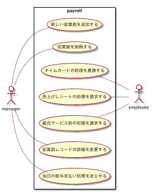
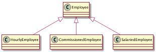
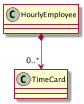
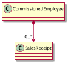
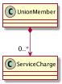
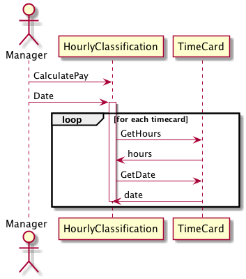
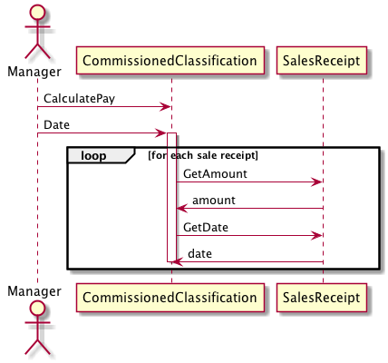
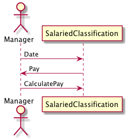
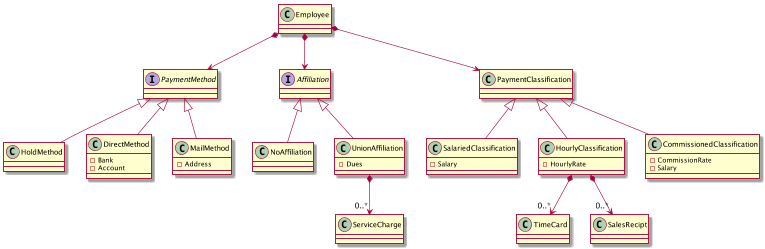

# 給与システムの基本仕様

+ 従業員の一部は時給である。彼らの給与は、従業員レコードが持つフィールド項目のひとつに登録されている時給をベースに支払われる。ただし、8時間以上働いた場合、時間外労働として通常の時給の1.5倍が支払われる。給与は毎週金曜日に支払われる。
+ 従業員の一部は固定給である。彼らの給与は月末に支払われる。給与の額は、従業員レコードのフィールド項目のひとつである。
+ 固定給の従業員の一部は、営業成績に応じて成功報酬を受ける。彼らは、売上日と売上金額を記録したレシートを提出しなければならない。成功報酬額は、彼らの従業員レコードのフィールドの項目の１つに記録されている。彼らの給与は隔週金曜日に支払われる。
+ 従業員は給与の受け取り方法を選択できる。給与小切手を指定の住所に郵送してもらうか、給与担当者が給与小切手を届けてくれるまで待つか、指定した銀行口座に直接入金してもらうか、いずれかを選択できる。
+ 従業員の一部は組合に入っている。彼らの従業員レコードには毎週支払わなければならない組合費の額がフィールド項目のひとつとして登録されている。組合費は必ず給与から天引きされる。また、組合はときおり各個人からサービス料を徴収する。これらのサービス料は組合から週単位で請求され、次回支払われる給与から天引きされる。
+ 給与アプリケーションは毎営業日に1回だけ実行され、その日が給与日である従業員に給与を支払う。システムは各従業員の給与日の通達を受け、給与が最後に支払われた日から指定された日までのレコード（記録）を元に給与を支払う。

# ユースケース



## ユースケース1:従業員を追加する

AddEmpトランザクションは新しい従業員を追加する。このトランザクションには必ず従業員(Employee)の「登録ID(EmpID)」、「名前(name)」、「住所(address)」が含まれる。このトランザクションには下記に示す3つの形式がある：
```text
AddEmp <EmpID> "<name>" "<address>" H <hourly-rate>

AddEmp <EmpID> "<name>" "<address>" S <monthly-salary>

AddEmp <EmpID> "<name>" "<address>" C <monthly-salary> <commission-rate>
```
  
従業員レコードは、必要なフィールド項目とともに作成される。
  
別記１：トランザクションが正しい形式で記述されていない場合

トランザクションが正しい形式で記述されていない場合は、エラーメッセージを吐き出す。エラーメッセージを出力するだけで、何も処理は行わない。



## ユースケース2:従業員を削除する

DelEmpトランザクションは従業員を削除する。このトランザクションの形式を下記に示す：

```text
DelEmp <EmpID>
```

このトランザクションが処理されると、指定の従業員レコードが削除される。

別記１：EmpIDが正しい形式で記述されていない場合や認識不能な場合

<EmpID>のフィールドが正しい形式で記述されていなかったり、有効な従業員レコードを参照していない場合、トランザクションはエラーメッセージを吐き出す。エラーメッセージを出力するだけで、何も処理をは行わない。

## ユースケース3:タイムカードの処理を要請する

TimeCardトランザクションはタイムカードレコードを作成し、それを適切な従業員レコードと結び付ける。

```text
TimeCard <EmpId> <date> <hours>
```

別記１：選択された従業員が時給ではない場合

エラーメッセージを出力するだけで、何も処理は行わない。

別記２：トランザクションが正しい形式で記述されていない場合

エラーメッセージを出力するだけで、何も処理は行わない。



## ユースケース4:売上げレシートの処理を要請する

SalesReceiptトランザクションは新規に売上げレシートを作成し、それを特別報酬を受ける従業員と結びつける。

```text
SalesReceipt <EmpID> <date> <amount>
```

別記１：指定された従業員が特別報酬対象の従業員でない場合

エラーメッセージを出力するだけで、何も処理は行わない。

別記２：トランザクションが正しい形式で記述されていない場合

エラーメッセージを出力するだけで、何も処理は行わない。



## ユースケース5:組合サービス料の処理を要請する

ServiceChargeトランザクションは組合サービス料(Union Service Charge)のレコードを作成し、それを組合員と結び付ける。

```text
ServiceCharge <memberID> <amount>
```

別記１：トランザクションが正しい形式で記述されていない場合

このトランザクションが正しい形式で記述されていなかったり、存在しない組合員を<memberID>が参照していたりする場合には、エラーメッセージを吐き出す。



## ユースケース6:従業員レコードの詳細を変更する

ChgEmpトランザクションは、指定された従業員のレコードをひとつだけ修正する。このトランザクションには、いくつかバリエーションがある。

```text
ChgEmp <EmpID> Name <name>                               従業員の名前を変更する
ChgEmp <EmpID> Address <address>                         従業員の住所を変更する
ChgEmp <EmpID> Hourly <hourlyRate>                       時給を扁壺する
ChgEmp <EmpID> Salaried <salary>                         固定給を変更する
ChgEmp <EmpID> Commissioned <salary> <rate>              成功報酬を変更する
ChgEmp <EmpID> Hold                                      給与担当者が届けてくれるまで待つ
ChgEmp <EmpID> Direct <bank> <account>                   直接引き落とし払い
ChgEmp <EmpID> Mail <address>                            給与小切手を郵送
ChgEmp <EmpID> Member <memberID> Dues <rate>             組合員情報を変更する
ChgEmp <EmpID> NoMember                                  組合員から外す
```

別記１；トランザクションエラー
トランザクションが正しい形式で記述されていない場合、または、<EmpID>が参照する従業員が存在しない場合、もしくは<memberID>が既存の組合員に与えられている場合、トランザクションはエラーメッセージを吐き出す。エラーメッセージを出力するだけで、何も処理は行わない。

## ユースケース7:当日の給与支払い処理を走らせる

Paydayトランザクションは、指定した日が給与日の従業員をすべて探し出し、支払うべき金額を計算し、指定され方法で支払いを行う。

```text
Payday <date>
```



時給の従業員の給与計算



成功報酬のある従業員の給与計算



固定給の従業員の給与計算

# コアモデル
